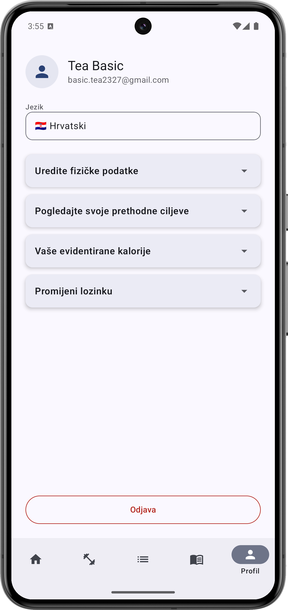
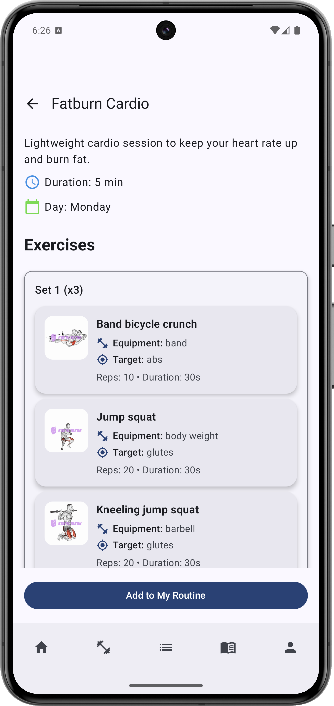
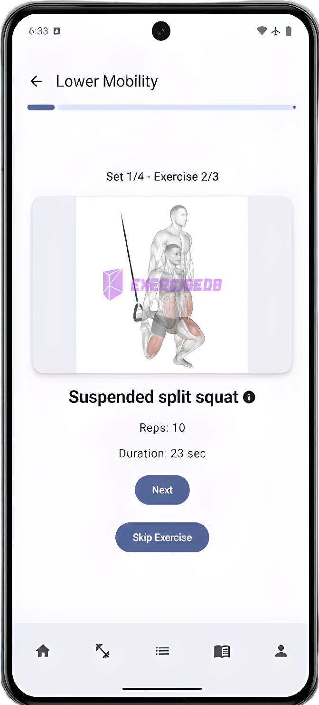
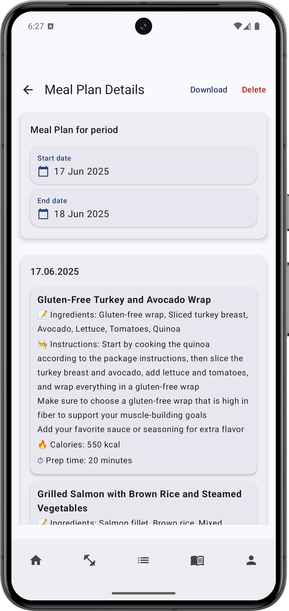
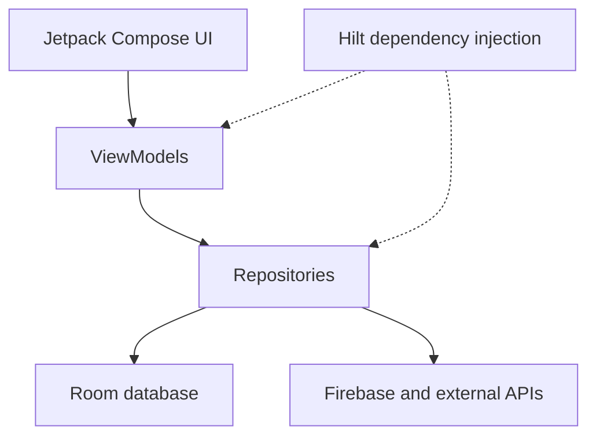

# FitnessTracker

[](https://developer.android.com/)
[](https://kotlinlang.org/)
[](https://developer.android.com/compose)
[](app/build.gradle.kts)

FitnessTracker is a native Android application that brings workout planning, exercise guidance, progress tracking, calorie logging, and personalized meal planning into one experience. It was developed as the practical component of my master's thesis in Applied Computing at the University of Split.

## Highlights

- Create personal workout routines or start from predefined templates.
- Follow workouts exercise by exercise, including sets, repetitions, rest periods, and progress.
- Browse exercise details with illustrations and online GIF support.
- Record completed workouts, calories, goals, and physical measurements.
- Review weekly activity, BMI, and fitness progress.
- Generate personalized multi-day meal plans with an LLM based on dietary preferences and goals.
- Save meal plans locally and remotely, filter them by date, and export them as PDF.
- Receive localized daily workout reminders through WorkManager.
- Use the application in English, Croatian, German, French, or Italian.

## Screenshots

<table>
  <tr>
    <td>
      
    </td>
    <td>
      
    </td>
  </tr>
  <tr>
    <td>
      
    </td>
    <td>
      
    </td>
  </tr>
</table>

## Architecture

The project follows an MVVM-oriented, layered structure. ViewModels expose screen state to Compose UI, repositories coordinate local and remote data sources, and mappers keep persistence and transport models separate.



The combined repositories provide a local-first flow: cached Room data is used when available, while Firebase supports synchronization and recovery across devices.

## Technologies


| Area | Tools |
| --- | --- |
| Language and UI | Kotlin, Jetpack Compose, Material 3 |
| State and concurrency | ViewModel, Coroutines, Flow, LiveData |
| Architecture | MVVM, repository pattern, DTO/entity mappers |
| Dependency injection | Hilt, KSP |
| Local storage | Room, DataStore |
| Cloud services | Firebase Authentication, Firebase Realtime Database, Supabase Storage |
| Networking | Ktor, OkHttp, Retrofit, Kotlin Serialization, Gson |
| Background work | WorkManager, Hilt Worker |
| Media and motion | Coil, GIF support, Lottie |
| Location search | Photon API |
| Quality tooling | JUnit, Espresso, Compose UI Test, ktlint |

## Project Structure

```text
app/src/main/java/com/tbasic/fitnesstracker/
├── data/           # Domain, DTO, and Room entity models
├── data/local/     # Room database, DAOs, and converters
├── data/mapper/    # Local/remote model mappings
├── di/             # Hilt modules
├── localization/   # Runtime language handling
├── repository/     # Local and remote data coordination
├── ui/             # Compose screens, navigation, components, and theme
├── utils/          # Date, location, and worker helpers
├── vm/             # ViewModels and UI state
└── worker/         # Daily notification worker
```

## Local Setup

### Requirements

- Android Studio with JDK 11 support
- Android SDK 35
- A Firebase project
- Development credentials for the optional external services

### 1. Clone the project

```bash
git clone git@github.com:Tea27/FitnessTracker.git
cd FitnessTracker
```

### 2. Configure Firebase

1. Create a Firebase project.
2. Register an Android app with package name `com.tbasic.fitnesstracker`.
3. Enable Firebase Authentication and Realtime Database.
4. Download `google-services.json` and place it in `app/`.
5. Configure restrictive Realtime Database rules before running the app with real user data.

The Firebase configuration file is intentionally excluded from version control.

### 3. Configure local properties

Add the following entries to the root `local.properties` file. Values shown below are placeholders.

```properties
DATABASE_URL=https://your-project.supabase.co
API_KEY="YOUR_DEVELOPMENT_API_KEY"
API_URL="YOUR_LLM_API_URL"
API_MODEL_ID="YOUR_MODEL_ID"
PHOTON_URL="https://photon.komoot.io/api/"
PHOTON_USER_AGENT="FitnessTracker/1.0"
```

`local.properties`, Firebase configuration, environment files, and signing keys are excluded through `.gitignore`.

### 4. Build

```bash
./gradlew assembleDebug
```

Alternatively, open the project in Android Studio, sync Gradle, and run the `app` configuration on an emulator or Android device.

## Security Note

Keeping credentials out of Git prevents accidental source-code exposure, but values compiled into an Android `BuildConfig` can still be extracted from the APK. Use only restricted, disposable development credentials in a client build. A production deployment should call private AI services through an authenticated backend rather than embedding a provider secret in the Android application.

Firebase data access must be protected independently with Authentication, Security Rules, API restrictions, and App Check.

## Master's Thesis

**Development of the “FitnessTracker” Mobile Application**  
Master's thesis in Applied Computing, University of Split, University Department of Professional Studies, 2025.

The thesis describes the product requirements, technology choices, MVVM implementation, local and remote data synchronization, workout execution flow, localization, and AI-assisted meal-plan generation. The PDF and LaTeX source are maintained separately from the application repository.

- [View the thesis repository](https://github.com/Tea27/FitnessTracker-Thesis)
- [Read the thesis PDF](https://github.com/Tea27/FitnessTracker-Thesis/blob/main/basic_zavrsni.pdf)

## Author

**Tea Bašić**

